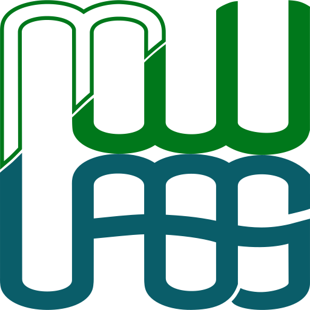

# mwu labs site

  

## Description

Code for <https://mwulabs.com> and will also be a home for writeups and experiments.

Main tenet: everything, that legally can be, will be open source and serve as inspiration/guidance.  
Keeping things as barebones/minimal/optimized as possible for now.

Currently hosted on [Netlify](https://www.netlify.com/).

## Favicon

[How to Favicon in 2023: Six files that fit most needs](https://evilmartians.com/chronicles/how-to-favicon-in-2021-six-files-that-fit-most-needs>)

[build.sh](build.sh) -> [build-favicons-with-hash](./scripts/build-favicons-with-hash.sh)
